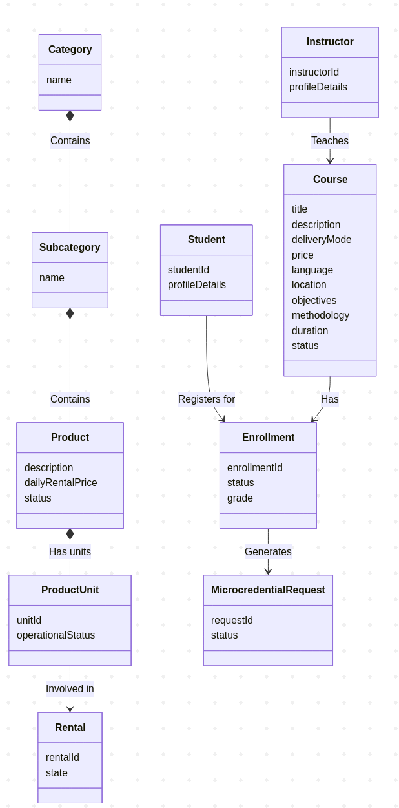
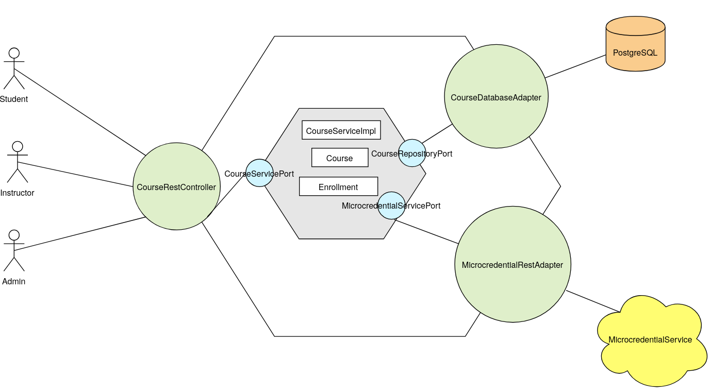
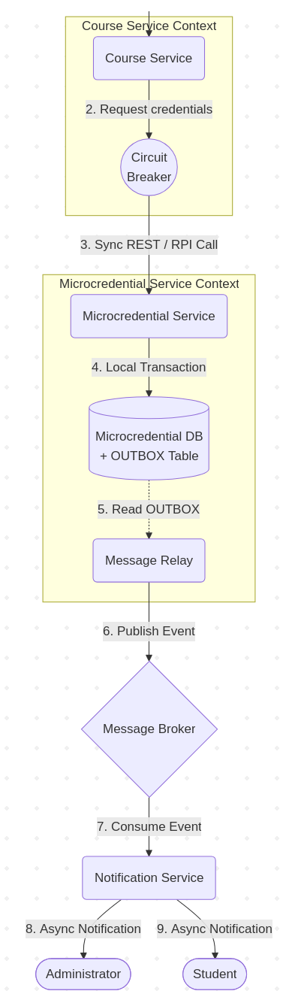

# PR 1
Alejandro Pérez Bueno
Mar 29, 2026

- [Exercise 1](#exercise-1)
  - [Domain model](#domain-model)
- [Exercise 2](#exercise-2)
  - [Identified subdomains](#identified-subdomains)
  - [System operation mapping](#system-operation-mapping)
- [Exercise 3](#exercise-3)
- [Exercise 4](#exercise-4)
- [Exercise 5](#exercise-5)



## Exercise 1

#### Commands

- Actor: Administrator
  - Use case: Update Product Description
  - Command name: `updateProductDescription`
  - Description: Updates the text description of a product in the
    catalog.
- Actor: Administrator
  - Use case: Update Product Price
  - Command name: `updateProductPrice`
  - Description: Modifies the daily rental price of a product.
- Actor: Administrator
  - Use case: Remove Product
  - Command name: `removeProduct`
  - Description: Deregisters a product and all its associated units,
    marking them as inactive.
- Actor: Administrator
  - Use case: Update Unit Status
  - Command name: `setUnitNonOperational`
  - Description: Designates a specific product unit as non-operational.
- Actor: Administrator
  - Use case: Manage Course
  - Command name: `createCourse`
  - Description: Creates a new audiovisual training course and
    associates it with an existing instructor.
- Actor: Administrator
  - Use case: Manage Course Enrollment
  - Command name: `openEnrollment`
  - Description: Opens the enrollment period for a specific course.
- Actor: Administrator
  - Use case: Manage Course Enrollment
  - Command name: `closeEnrollment`
  - Description: Closes the enrollment period for a specific course.
- Actor: Administrator
  - Use case: Manage Course
  - Command name: `closeCourse`
  - Description: Closes the course records after the course delivery and
    grading are complete.
- Actor: Administrator
  - Use case: Manage Microcredentials
  - Command name: `approveMicrocredential`
  - Description: Approves pending microcredential requests individually
    or in batches.
- Actor: Instructor
  - Use case: Manage Course Details
  - Command name: `modifyCourseDetails`
  - Description: Modifies course details (title, description, delivery
    mode, objectives, methodology, duration, language).
- Actor: Instructor
  - Use case: Manage Grades
  - Command name: `closeGradeReport`
  - Description: Closes the grade reports at the end of the course,
    automatically triggering the generation of microcredentials.
- Actor: User / Student
  - Use case: Course Enrollment
  - Command name: `enrollInCourse`
  - Description: Enrolls a user in a specific available training course.

#### Queries

- Actor: User / Student
  - Use case: Browse Courses
  - Query name: `browseCourses`
  - Description: Retrieves a list of available courses.
- Actor: User / Student
  - Use case: View Course Details
  - Query name: `viewCourseDetails`
  - Description: Retrieves the detailed course sheet (title,
    description, delivery mode, price, language, location, etc.).
- Actor: Instructor
  - Use case: View Students
  - Query name: `viewEnrolledStudents`
  - Description: Retrieves the list of students enrolled in a specific
    course.
- Actor: Administrator
  - Use case: Manage Microcredentials
  - Query name: `viewPendingMicrocredentials`
  - Description: retrieves all pending microcredential requests to be
    handled.

### Domain model

## Exercise 2

### Identified subdomains

- Catalog Subdomain: manages inventory of the audiovisual equipment,
  including categories, subcategories, products and their operational
  status
  - Mapped Service: `CatalogService`
- Rental Subdomain: manges the lifecycle of material rentals and
  tracking which units are currently committed to users
  - Mapped Service: `RentalService`
- Academic & Training Subdomain: handles training courses, instructors,
  students, enrollments and grades.
  - Mapped Service: `CourseService`
- Microcredentials Subdomain: Tesponsible for managing the lifecycle of
  microcredential requests, approvals and acting as the bridge to the
  external credential generation system.
  - Mapped Service: `MicrocredentialService`

### System operation mapping

- `updateProductDescription` is mapped to `CatalogService` and is
  handled entirely by this service.
- `updateProductPrice` can be mapped to `CatalogService`. Requires a
  synchronous query to the `RentalService` to verify the precondition
  that no product units are currently committed to any rental.
- `removeProduct`: Mapped to `CatalogService`. Also neeeds a synchronous
  query to the `RentalService`, to ensure the product is not involved in
  an active rental before marking it as “inactive”.
- `setUnitNonOperational` is mapped to `CatalogService`. Requires a
  synchronous query to the `RentalService` to verify that the product
  unit is not involved in a rental agreement.
- `createCourse`, `modifyCourseDetails`, `openEnrollment`,
  `closeEnrollment`, `closeCourse` and `enrollInCourse`: Mapped to
  `CourseService`. Handled entirely by this service.
- `browseCourses`, `viewCourseDetails` and `viewEnrolledStudents` are
  mapped to `CourseService`
- `closeGradeReport` is mapped to `CourseService`. Once the grade report
  is closed, this service must make a synchronous request to the
  `MicrocredentialService` to generate microcredentials for students who
  passed.
- `viewPendingMicrocredentials`: Mapped to `MicrocredentialService`.
  Handled entirely by this service.
- `approveMicrocredential`: Mapped to `MicrocredentialService`. Upon
  processing the approval, this service must trigger asynchronous
  notificatioms to the student and the administatror. This may involve
  collaborating with a generic `NotificationService` if one exists in
  the wider enterprise architecture.

## Exercise 3

## Exercise 4

Closing a course, finalizing grade reports and generating
microcredentials reqire specific patterns to meet the project
guidelines. This system must support both synchronous and asynchronous
operations. The project requires a synchronous request for credential
generation. The Remote Procedure Invocation (RPI) pattern fits this
need, it uses protocols like REST or gRPC to handle communication
between services. Once an instructor finalizes a grade report, the
Course Service uses RPI to prompt the Microcredential Service.

Relying on synchronous requests introduces the risk of partial failures,
but a Circuit Breaker pattern aplied to the RPI proxy prevents these
errors from spreading, as it monitors request success and failure rates.
If failures pass a set limit the circuit breaker blocks new requests for
a period of time, giving the system tume to recover.

Administrators and students must receive notifications asynchronously,
and this requirement perfectly fits a Messaging pattern. It relies on a
message broker so services can exchange information without blocking
clients. The Microcredential Service pairs this with the Domain Event
pattern to publish updates to a channel. A Notification Service then
subscribes to this channel to alert users.

The Microcredential Service updates its local database and sends
notifications when processing requests or approvals. The Transactional
Outbox pattern ensures message delivery without using distributed
transactions: It saves event messages in an OUTBOX table during the
local database transaction and a Message Relay component reads this
table and forwards the messages to the broker.

Below is a diagram of the solution to this apprpach:

## Exercise 5

Implementing the Saga pattern is the proper solution in this case for
managing distributed transactions between Photo&Film4You and
Koursera.The integration tests revealed data inconsistencies including
unreleased stock from canceled rentals and payments processed for
unavailable items. These issues come from the microservice architecture
where each service uses their own isolated database. Traditional
two-phase commit mechanisms fail to scale efficiently in these
environments.

Sagas offer a neat alternative by dividing a distributed transaction
into a sequence of local transactions. These individual steps are
coordinated via asynchronous messaging. When am operation fails the
system compensates transactions to reverse the previous steps and
restore consistency. For example, a processed Koursera payment will be
automatically refunded if Photo&Film4You cannot confirm equipment
availability.

This architecture provides specific advantages. For example there is
data consistenty across the platform without relying on synchronous
database locks. This way system resilience improves because message
brokers buffer commnications until individual services are ready to
process them. Also development teams can continue to scale their modules
independently since the database per service model is kept intact.

These benefits come with a fews tradeoffs:

- Implementation complexity increases due to the necessity of message
  queue management and explicit rollback logic.
- Inherent delay before all databases reflect the final transaction
  state, which requires client interfaces to handle pending statuses.
- Transaction isolation is compromised: because local commits occur
  sequentially, other system queries might read intermediate data before
  the entire saga concludes.
