

# Exercise 2: Operation Evidence

## Course Service

### C1. Find All Courses

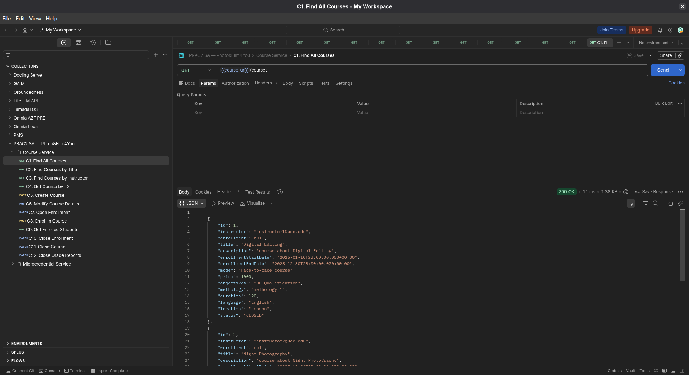



### C2. Find Courses by Title

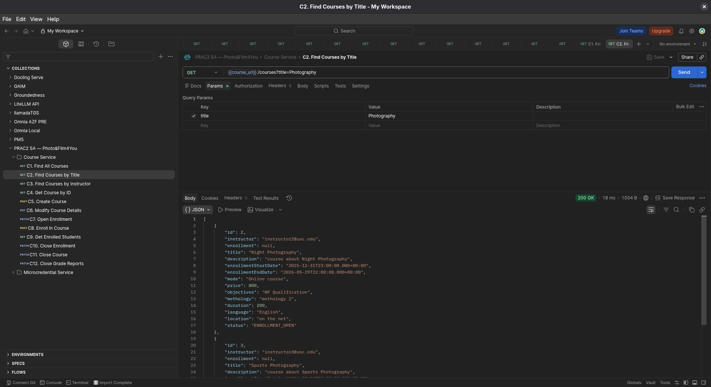



### C3. Find Courses by Instructor

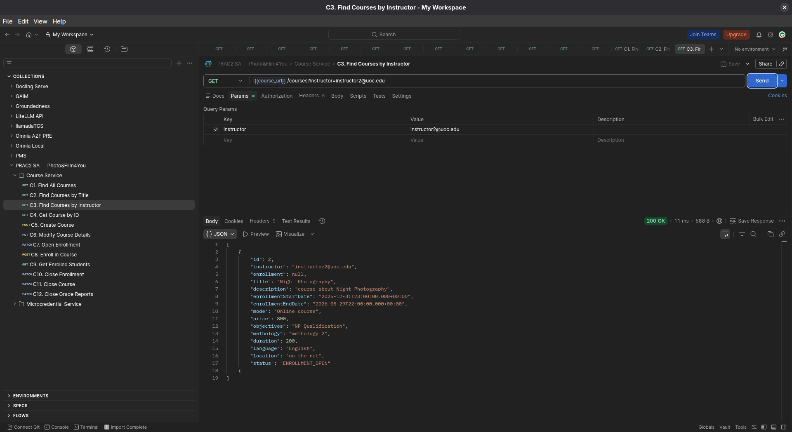



### C4. Get Course by ID

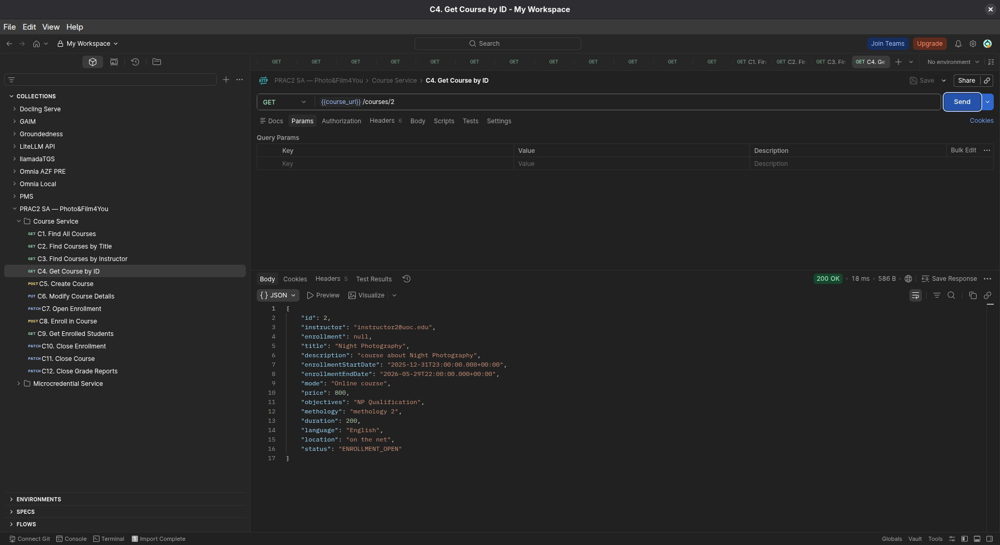



### C5. Create Course

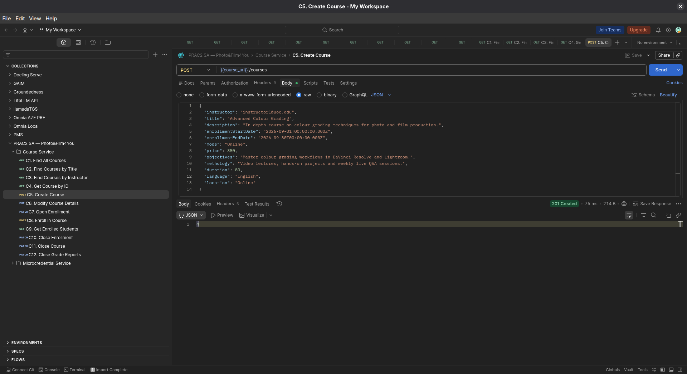



### C6. Modify Course Details

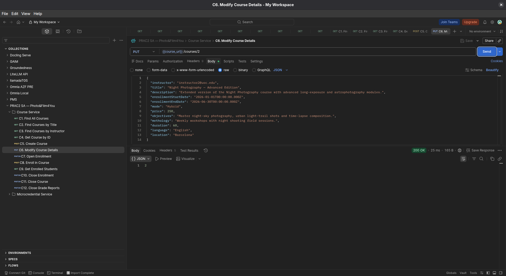



### C7. Open Enrollment

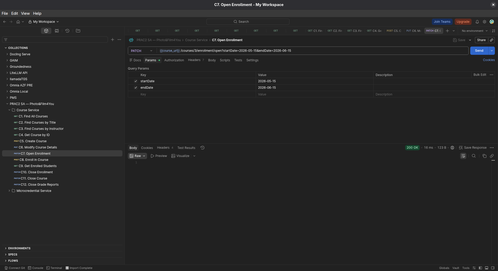



### C8. Enroll in Course

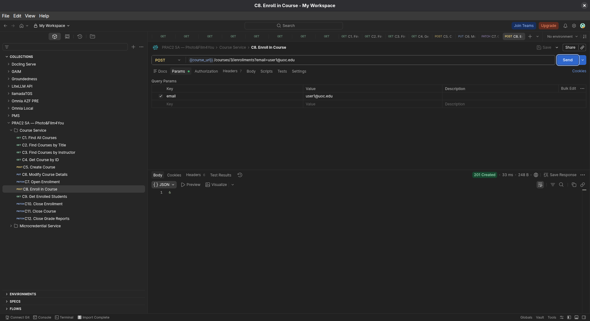



### C9. Get Enrolled Students

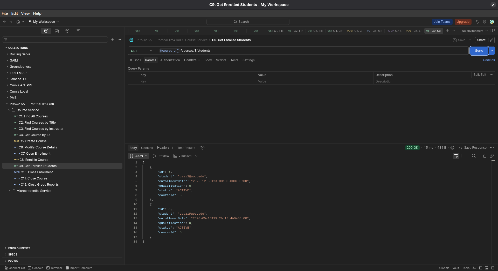



### C10. Close Enrollment

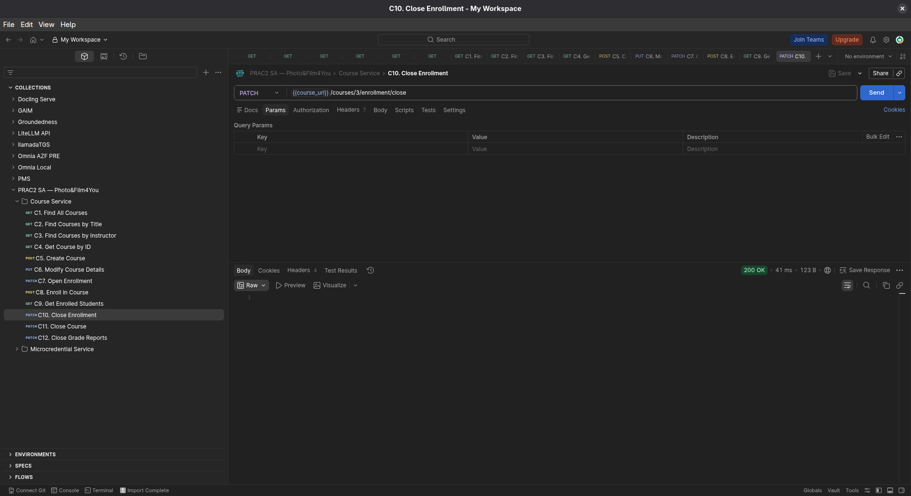



### C11. Close Course

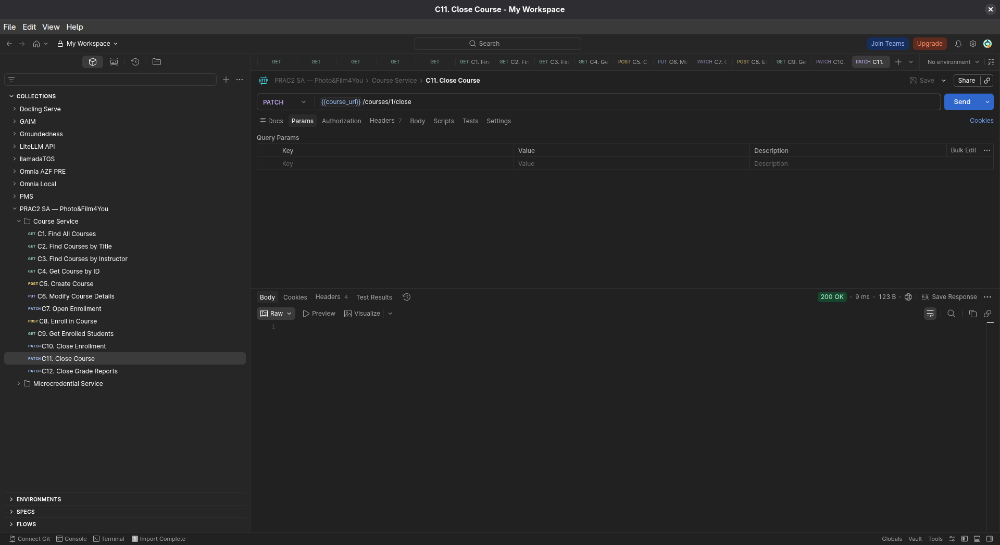



### C12. Close Grade Reports

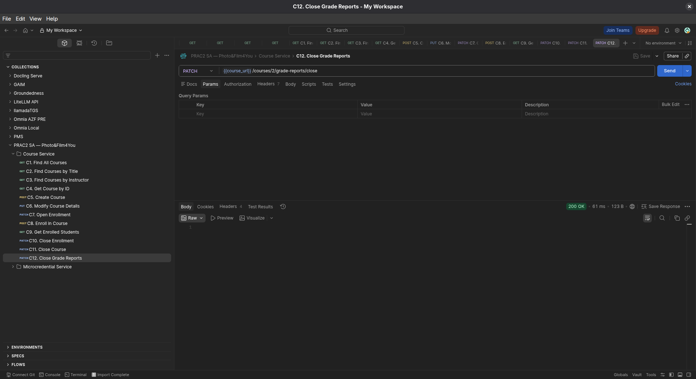



## Microcredential Service

### M1. Request Microcredential for Enrollment 3

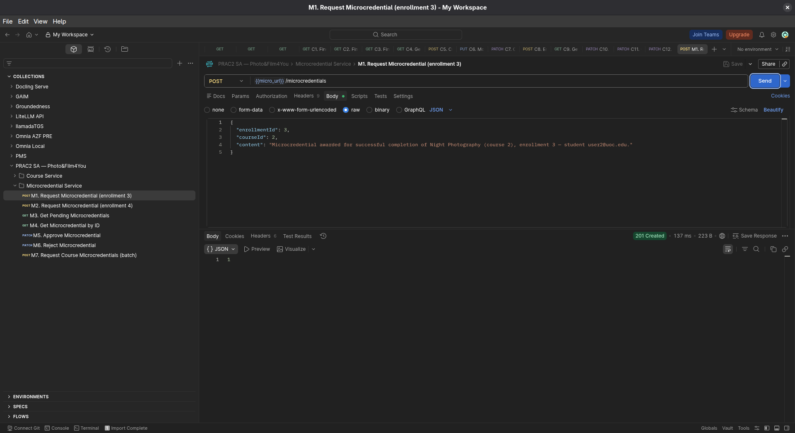



### M2. Request Microcredential for Enrollment 4

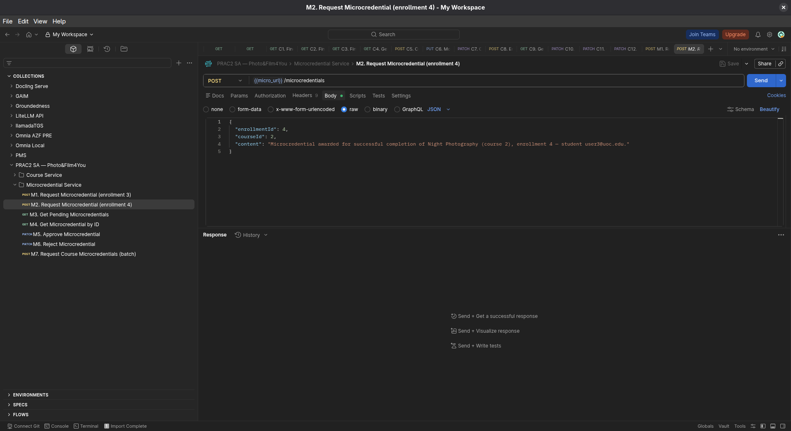



### M3. Get Pending Microcredentials

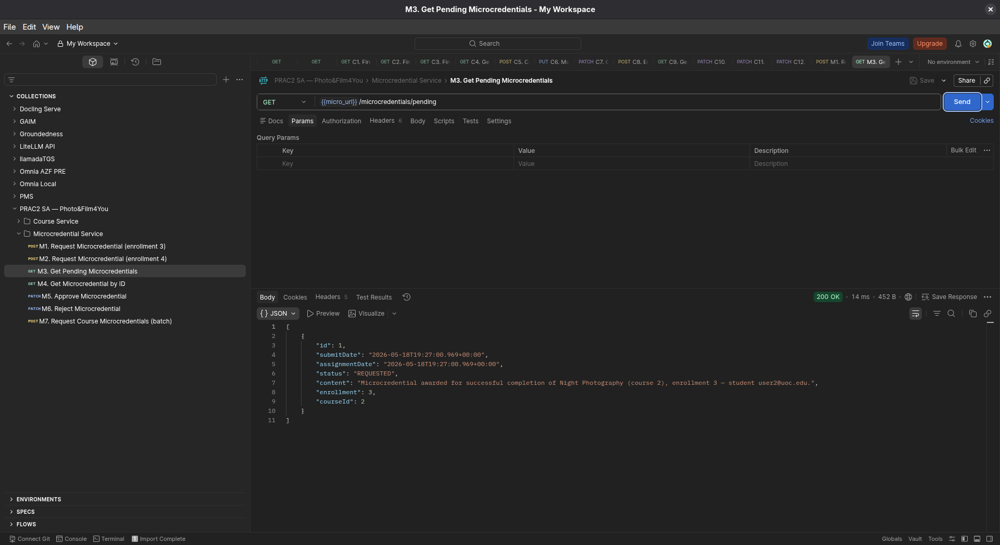



### M4. Get Microcredential by ID

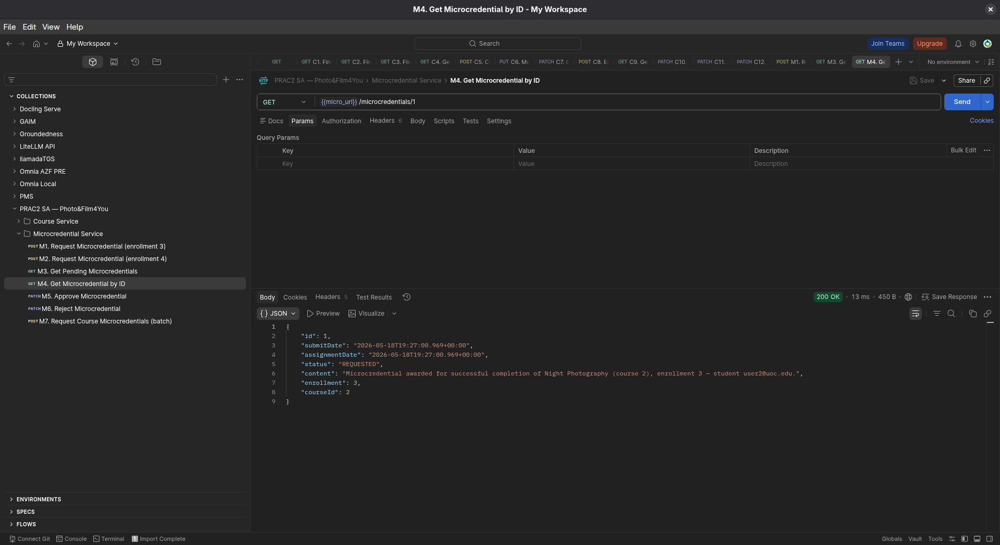



### M5. Approve Microcredential

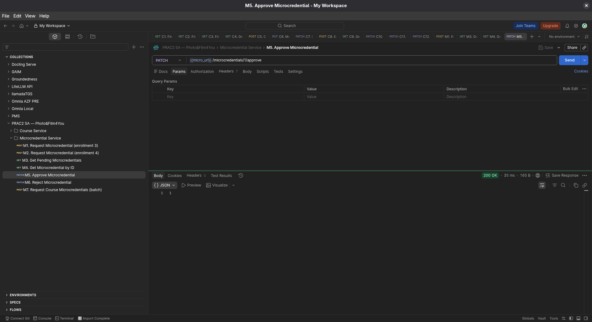



### M6. Reject Microcredential

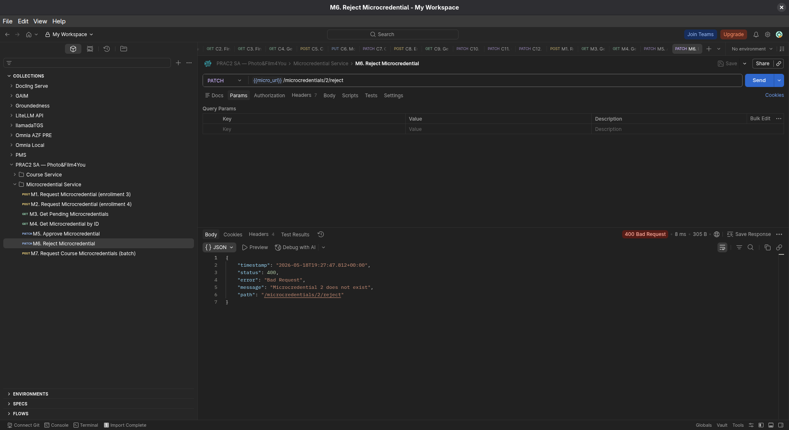



### M7. Request Course Microcredentials

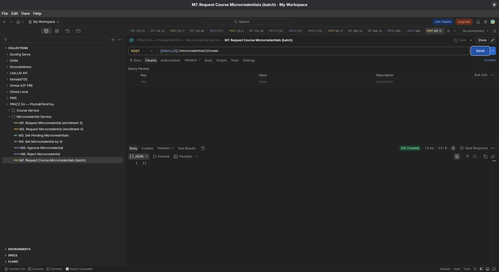
